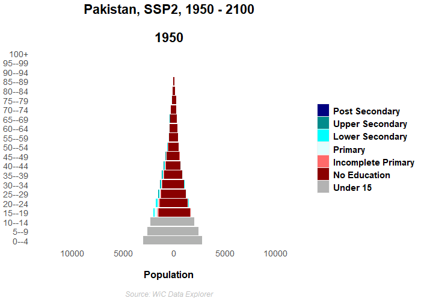
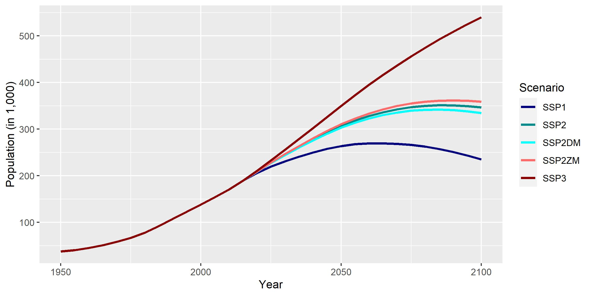

# Standard slide with R code

```{r, load_refs, include=FALSE, cache=FALSE}
library(RefManageR)
BibOptions(check.entries = FALSE,
           bib.style = "numeric",
           cite.style = "authoryear",
           style = "markdown",
           hyperlink = FALSE,
           dashed = FALSE)
litera <- ReadBib("./litera.bib", check = FALSE)
```

```{r, fig.height=4.5, fig.width=12, fig.retina=2, fig.align='center', message=FALSE, warning=FALSE}
library(tidyverse)
ggplot(cars, aes(x = dist, y = speed)) + 
  geom_point() + 
geom_smooth(method = 'lm', formula = y ~ poly(x, 2))
```

---

## Test
<center>
</img>
</center>

---

### Test
<center>
</img>
</center>

---

## Test

- `r Citet(litera, "lutz2017forecasting")`
- `r Citep(litera, "lutz2017forecasting")`
- abc


1. abc
2. abc
3. abc

---
# References

```{r refs, echo=FALSE, results="asis"}
PrintBibliography(litera)
```
